# Battleship Game!
Battleship is a classic game where you play against the computer guessing the location of each others ships on a grid board.
It is built using Python and runs through the Code institute mock terminal on 
[Heroku](<https://project-3-battleshipgame.herokuapp.com/>).

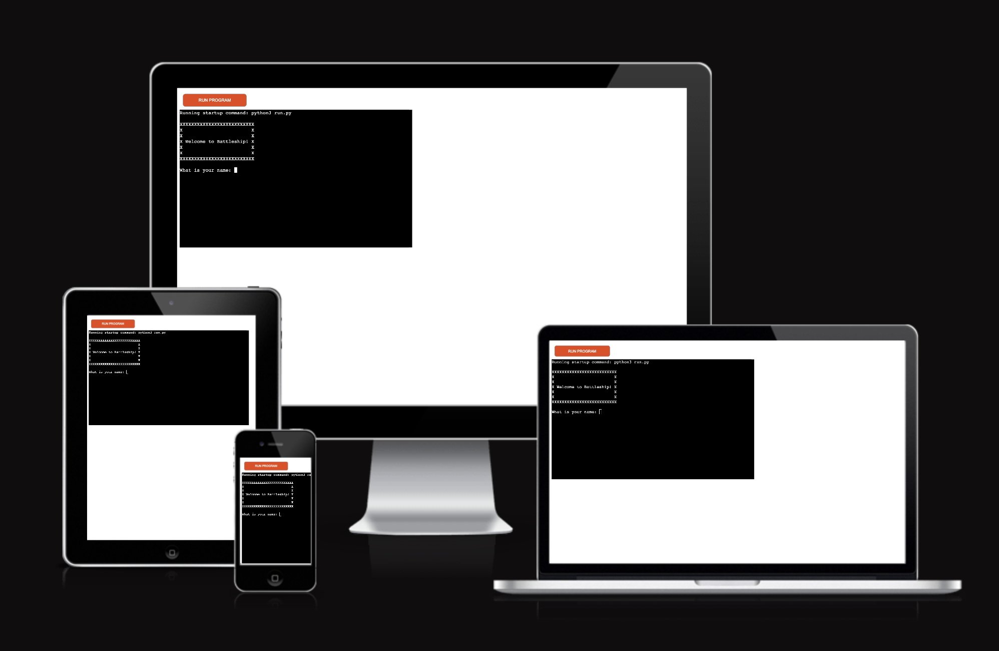

# Contents

* [**User Experience**](#user-experience)
  * [Flowchart](#flowchart)
* [**Existing Features**](#existing-features)
  * [User Name Input](#user-name-input)
  * [Difficulty Selection](#difficulty-selection)
  * [Dynamic Attempts](#dynamic-attempts)
  * [Word Prompt](#word-prompt)
  * [Dynamic Hangman Image](#dynamic-hangman-image)
  * [Win/Loss Tracker](#winloss-tracker)
* [**Desired Features**](#desired-features)
* [**Technologies Used**](#technologies-used)
* [**Testing and Quality Control**](#testing-and-quality-control)
  * [Device and Browser Testing](#device-and-browser-testing)
* [**Bugs**](#bugs)
* [**Deployment**](#deployemnt)
  * [Cloning a Project](#cloning-a-project)
* [**Credits**](#credits)
  * [Content](#content)
* [**Acknowledments**](#acknowledgements)

# User Experience
Users input their name and choose a difficulty level. Then they attempt to sink the computers battleship by choosing a row and a column on a grid. The grid size is generated by the choice of difficulty level. The game has 5 rounds to play and if neither the computer nor the player successfully sink each others battleship the game is over and the player has a choice of play another game or quit.

## Flowchart
The Flowchart for Battleship Game! was built using [Lucidchart](https://www.lucidchart.com/pages).

The flowchart consists of the game flow and primary gameplay loop. 

The user is first prompeted to input a name and select a difficulty level, the input is then valuated. If the name input containes anything other then a letter the player gets an error and is prompted to enter again. Also if the level choice contains anything other then a number between 1-3 he gets a error and is asked to enter again.

Then the program generates the board for the player and computer with hidden ships. The player is asked to input a quess for the row and column.If the player inputs anything other then a number between 1 and the board size chosen he is prompted with an error and asked to enter again. If the input passes the validation the computer makes a random guess on the players board and both boards are then updated with the choices. Also the program counts the rounds played.

If either the computer or the player guess correctly and sink the battleship they get a message they won or lost and are asked if they want to playa again. If the player wants to play again the game is reset and starts again from the beginning. If they choose to not continu the game quits. This input is also validated for correct input.

If the player or computer do not sink the battleship in 5 rounds the game is over and the computer wins. Here the player is also asked if he wants to play again or quit.

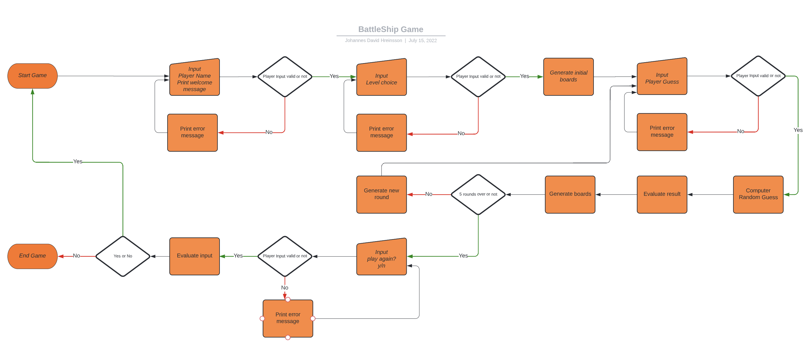

[Back to top](<#contents>)

# Existing Features

## Inital gameplay

This is the sceen you are presented with at the beginning of the game.

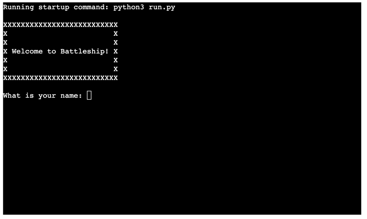

## Player Name Input
The player is prompted, during the initial loop of the game, to input a name. The name is checked to ensure it is containing only letters and does not contain numbers. If the player inputs an invalid name, the program prompts them to enter again. If the player inputs a valid name, the input is stored as the name variable.
The uname variable is used to add a personal touch to the game experience for the player.

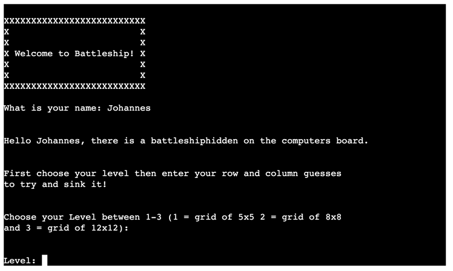

## Difficulty Selection
The player is prompted to choose a difficulty level between 1-3. 1 being a board of 5x5, 2 - 8x8 and 3 - 12x12. If the player enters anything other then a letter between 1-3 he is prompted with an error and asked to enter again. If the input is valid the boards for the player and computer are generated with a ship hidden on the boards.

## Dynamic Gameplay
Once the user selects a difficulty, the program then sets the number of rounds the player and computer get for guessing the location of the ship and generates the boards with a hidden ship.

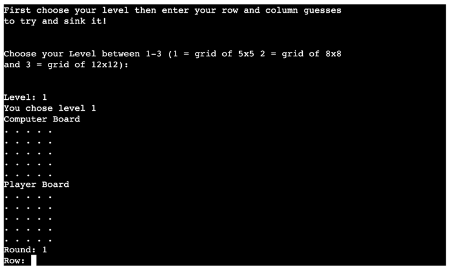

## Guess Prompt

Now the player is prompted with a input for row and column. The input is validated and the boards then updated with the guesses of the player and random guess from the computer. The players guesses are marked with "@" and the computers with "$" and it here is a hit the board is marked with an "X"

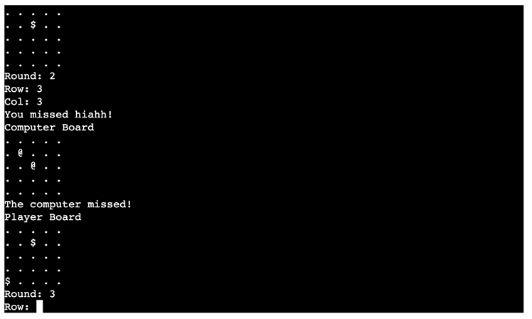

## Wrong entry sample

Here is an example of a invalid entery from the player in the row prompt, the program prompts the player with an error and askes him to enter again.

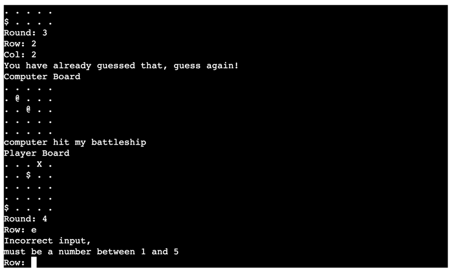

## End of rounds gameplay

The player gets 5 rounds to guess the postition of the computers ship, if he is unsuccessful the game ends with the computer winning. Then he is prompted if he wants to playa again. This input is also validated for correct input.

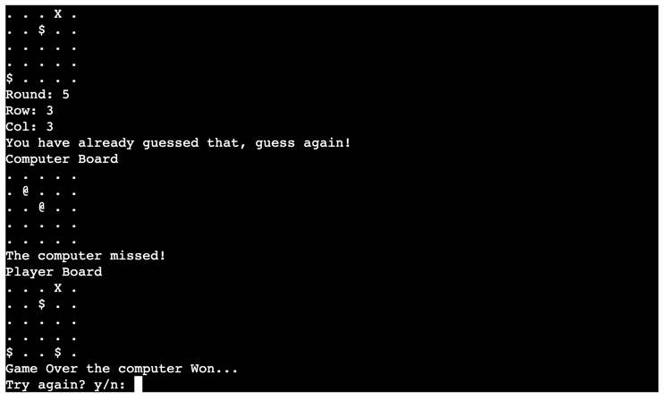

[Back to top](<#contents>)

# Desired Features
* Adding a score function
* Show the players ship on the board
* Help function that may be called during the game to remind user of rules. 

[Back to top](<#contents>)

# Technologies Used

* [Python](https://www.python.org) - Sole programming language used to program the game.
* [Heroku](https://www.heroku.com) - Hosting platform for the programme.
* [[Lucidchart](https://www.lucidchart.com/pages) - Used to design and create the game flowchart.
* [Github](https://github.com) - Acts as a repository for the site's code.
* [Gitpod](https://www.gitpod.io) - Builds and edits the code for the site.

[Back to top](<#contents>)

# Testing and Quality Control

Battleship Game was tested in both Gitpod during development and on the Heroku Terminal following deployment.
Expected results from user inputs were checked and corrected when errors occured as follows:

1. **Program Start**
    - Confirmed program started without crashes.
    - Introduction displayed without issue.
    - Username input prompt runs on startup as expected.
2. **Username Input**
    - Confirmed valid username input stored in variable.
    - Erroneous inputs call error message and input prompt again as expected.
3. **New Game Function**
    - Confirmed rules are printed to the screen correctly.
4. **Difficulty Selection**
    - Confirmed that valid input for the levels is correct.
    - Erroneous input calls error message and input prompt as expected.
5. **Dynamic Gameplay**
    - Checked if the program calculated and displayed the rounds correctly.
    - Checked for board generation was done correctly.
6. **Guess prompt**
    - Confirmed that the guess input function worked correctly.
    - Confirmed that tha input was correctly validated.
7. **Wrong entry**
    - Confirmed that validation function worked as it should.
    - Tested each validation for errors.
8. **End of rounds gameplay**
    - Confirmed that when the round count function ended its count that the game quit.
    - Confirmed that the player would be prompted to begin again and the function worked as it should.
10. **Play Again function**
    - Confirmed game repeats when the player selection inputs "y".
    - Confirmed game returns to start of the program.
    - Confirmed game quits if player inputs "n".
11. **End of game function**
    - Checked if the end of game function worked as is should.
    - Confirmed game repeats when the player selection inputs "y".
    - Confirmed game returns to start of the program.
    - Confirmed game quits if player inputs "n".

[Back to top](<#contents>)

All python files pass through validation using the [Pep8](http://pep8online.com) online software. All files pass through with no errors present.

The example for the run.py result are below:

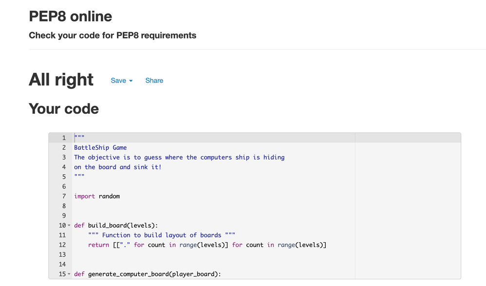

[Back to top](<#contents>)

## Device and Browser Testing

Hang that man! was tested on the Opera, Google Chrome, Safari, and Microsoft edge browsers. Heroku correctly displayed and ran the program on all browsers.

The game successfully ran through Heroku without errors occuring on the following devices:
* Mac
* iPad
* iPhone Xs

User testing was conducted by friends and family. They reported bugs and errors.

[Back to top](<#contents>)

# Bugs

During development the following bugs were identified and corrected:

* Validation of user inputs not working proprerly.
* End of game function not working as it should.
* Getting the computer random guess to work.

[Back to top](<#contents>)

# Deployemnt

The game was deployed via an online terminal developed by Code institute known as Heroku, developed to facilitate deployment and host applications created using backend languages such Python. The deployment process is as follows:

1. Create new Heroku app from Heroku dashboard
2. Name the app with a name that is available.
3. Choose the region from which you are from (Europe)
4. Select the create app button
5. Select 'Settings' from the main menu
6. Scroll to 'Config Vars' section and select 'Reveal Config Vars'
7. In the 'Key' field input 'PORT' in the 'Value' field input '8000'
8. Press 'Add' to add the value just entered
9. Scroll down to 'Add buildpack' and select it
10. Select 'Python' and save changes
11. Select 'Add buildpack' again and do the same with 'NodeJs'
12. Link the App to your repository
13. Select deploy

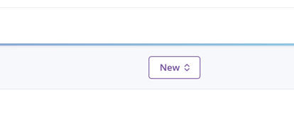

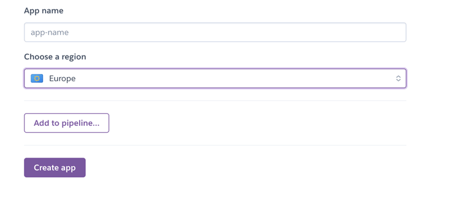

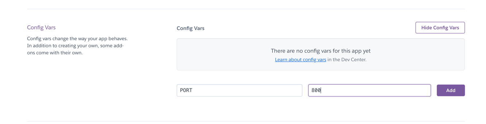

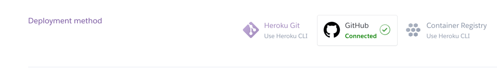

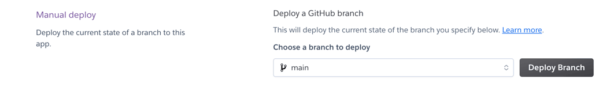

[Back to top](<#contents>)

## Cloning the repository

1. Go to https://github.com/
2. Log into account
3. Click on the repository to be cloned
4. Click the drop-down list arrow on the "Code" tab
5. Click on the copy link icon next to the url of the repository
6. Create a new repository and launch Gitpod to create a workspace from it
7. In the gitpod terminal type: "git clone"
8. Paste the copied link and press enter

[Back to top](<#contents>)

# Credits

## Content

* The Readme format was referanced from Miles-Cownie on [Github](https://github.com/Miles-Cownie/third-portfolio-project/blob/main/README.md).

[Back to top](<#contents>)

# Acknowledgements

The Game was completed as a Portfolio 3 Project piece for the Full Stack Software Developer (e-Commerce) Diploma at the [Code Institute](https://codeinstitute.net/). As such I would like to thank my mentor [Precious Ijege](https://www.linkedin.com/in/precious-ijege-908a00168/), the Slack community, and all at the Code Institute for their help and support. Also want to thank Miles Cownie for the README.md template which this readme is based on.Miles-Cownie on [Github](https://github.com/Miles-Cownie/third-portfolio-project/blob/main/README.md)

Johannes Hreinsson 2022

[Back to top](<#contents>)